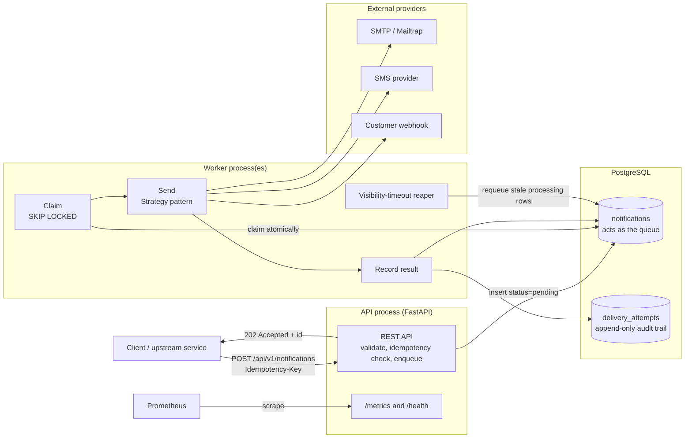
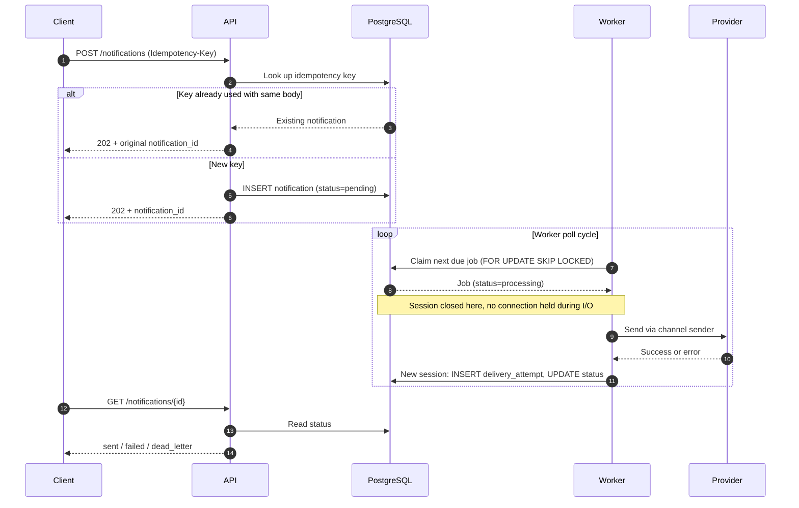
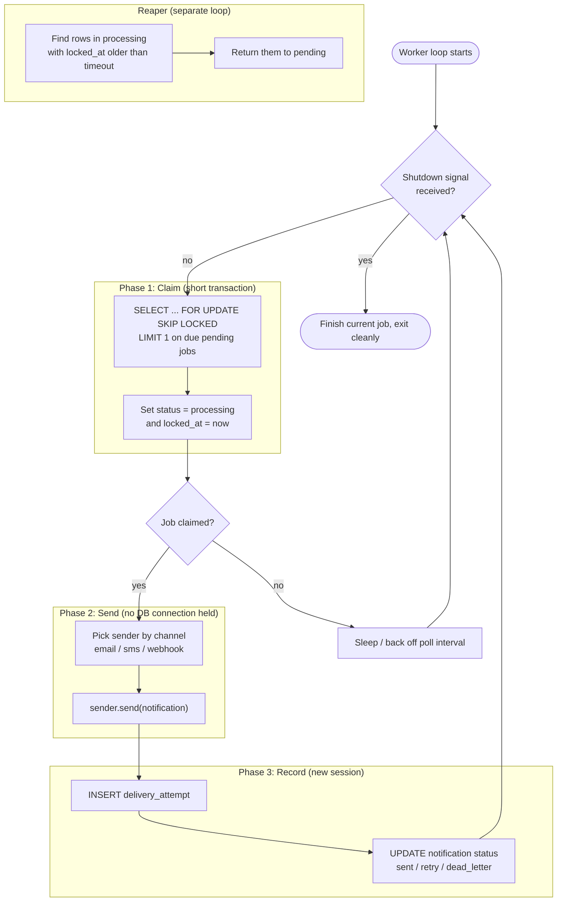
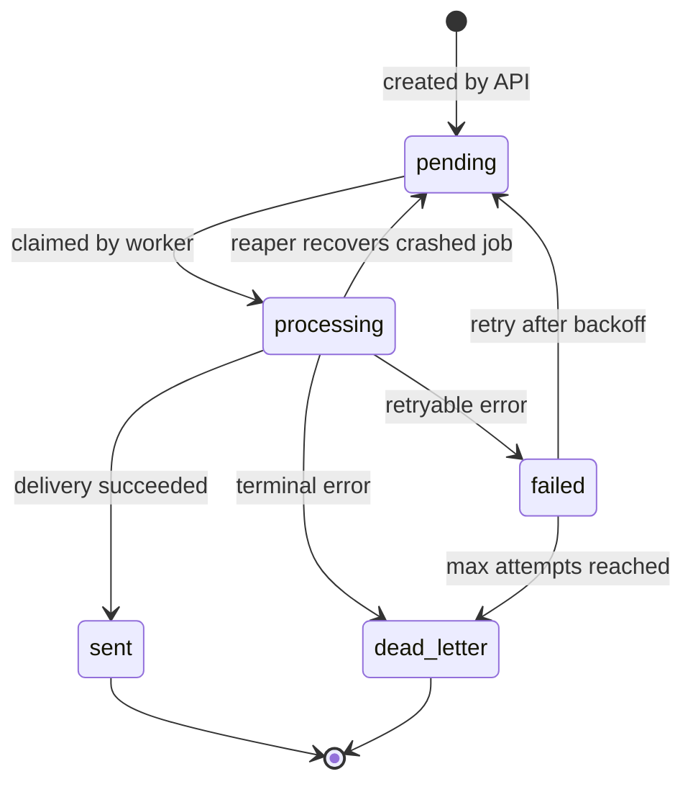
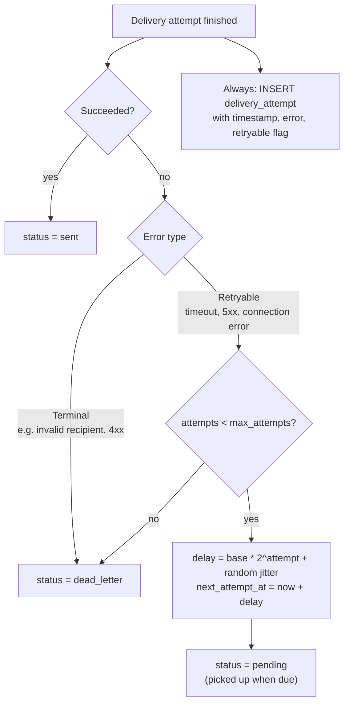
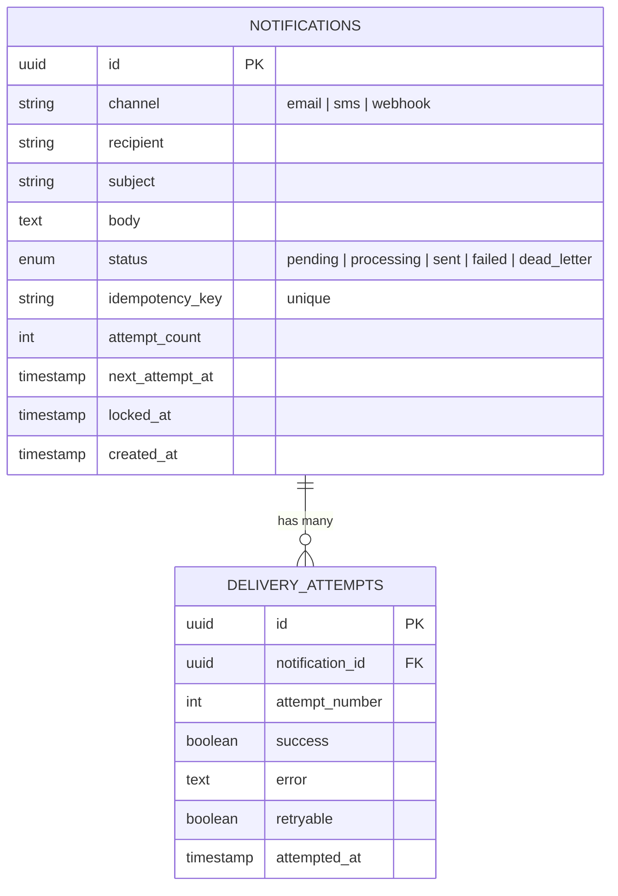

# Notification Service

<!--[CI](https://github.com/malom489/notification-service/actions/workflows/ci.yml/badge.svg)-->


A reliable, event-driven notification service that delivers messages over email, SMS, and webhooks, with a Postgres-backed job queue, retries, idempotency, and a full audit trail.

**Live demo:** _deployment in progress_ · **see Roadmap

## Why I Built This

I wanted to understand what actually happens when a system "sends a notification." The naive answer is "call an SMTP client and hope for the best." The real answer involves queues, retries, idempotency, failure classification, and the kind of operational thinking most tutorials skip.

This project is my attempt to build the real version, not the tutorial version.

## Table of Contents

- [Features](#features)
- [Tech Stack](#tech-stack)
- [Architecture](#architecture)
  - [System overview](#1-system-overview)
  - [Request lifecycle](#2-request-lifecycle)
  - [Worker internals](#3-worker-internals)
  - [Notification state machine](#4-notification-state-machine)
  - [Retry and dead-letter flow](#5-retry-and-dead-letter-flow)
  - [Data model](#6-data-model)
- [Design Decisions](#design-decisions)
- [Trade-offs](#trade-offs-i-considered)
- [Performance](#performance)
- [Testing](#testing)
- [Running Locally](#running-locally)
- [API Endpoints](#api-endpoints)
- [Project Structure](#project-structure)
- [Roadmap](#roadmap)

## Features

- **Three delivery channels:** Email (SMTP), SMS (provider-swappable), Webhook (HMAC-signed)
- **Postgres-as-queue:** atomic job claiming via `SELECT ... FOR UPDATE SKIP LOCKED`
- **Custom worker loop:** not Celery; explicit claim, send, and record phases
- **Visibility-timeout reaper:** recovers jobs stranded by crashed workers
- **Retries with exponential backoff and jitter:** configurable max attempts
- **Dead-letter state:** poison messages isolated after max attempts
- **Idempotency keys:** same key and same body gives the same result, no duplicate sends
- **Structured JSON logging** with **request ID correlation** across API and worker
- **Prometheus metrics:** `/metrics` endpoint with queue depth and counters
- **Graceful shutdown:** SIGTERM and SIGINT handled cleanly
- **Full audit trail:** every delivery attempt recorded with its error
- **Tested:** 22 tests, 75% coverage, including a 5-worker concurrency test with zero duplicate claims

## Tech Stack

| Layer | Technology |
|:---|:---|
| Framework | FastAPI |
| Language | Python 3.12 |
| Database | PostgreSQL 16 |
| ORM | SQLAlchemy 2.0 (async) |
| Migrations | Alembic |
| Queue | PostgreSQL (`FOR UPDATE SKIP LOCKED`) |
| Email | `aiosmtplib` (Mailtrap Sandbox in dev) |
| HTTP client | `httpx` |
| Logging | `python-json-logger` |
| Testing | pytest + pytest-asyncio + httpx |
| Container | Docker + Docker Compose |

## Architecture

### 1. System overview

Two long-running processes share one Postgres database. The API only accepts and records requests; the workers do all the delivery. The database is both the source of truth and the queue.



### 2. Request lifecycle

From the client's request to the final delivery. Note that the API responds as soon as the job is stored; delivery happens asynchronously.



### 3. Worker internals

Each job goes through three phases, each with its own database session. A separate reaper recovers jobs from crashed workers.



### 4. Notification state machine

Status is a Python enum, so invalid states and transitions are explicit.



### 5. Retry and dead-letter flow

Errors are classified first. Retryable errors get exponential backoff with jitter; terminal errors and exhausted jobs go to the dead-letter state.



### 6. Data model

Attempts live in their own table so the full history of each notification is preserved. (Simplified; see `app/models/` for the exact schema.)



## Design Decisions

### Why Postgres as the queue, not Celery + Redis

For moderate scale, PostgreSQL's `SELECT ... FOR UPDATE SKIP LOCKED` is production-viable. It provides:

- Atomic job claiming (no two workers get the same job)
- Built-in durability (transactions, WAL)
- No extra infrastructure to run or monitor
- Enqueueing in the same transaction as other writes
- Full SQL visibility for debugging

Celery + Redis would be faster at higher scale but adds a component to manage. I chose Postgres first because it teaches the queue pattern explicitly: nothing is hidden behind a library.

### Why a custom worker, not Celery

Celery is the standard answer. It's also a black box. By writing the worker loop myself, I had to solve:

- Job claiming (race conditions between workers)
- Visibility timeout (what if a worker crashes mid-job?)
- Retry scheduling (exponential backoff)
- Dead-letter handling

These are the actual problems any queue solves. Using Celery would have hidden them.

### Why `delivery_attempts` is a separate table

A notification can be attempted several times; success on the 3rd try after two timeouts is normal. A single "attempts" counter on the notification row loses the story. A separate table captures when each attempt happened, the specific error, and whether it was retryable. That is what makes the system debuggable at 2am.

### Why idempotency keys are client-supplied

A network timeout on the client doesn't mean the request failed; it might have been processed. Without idempotency, the client retries and the user gets two emails. With it, the client resends the same `Idempotency-Key` and the server returns the original result.

"Exactly once" delivery isn't achievable, but "exactly once *effect*" is, and that is what this achieves.

### Why the worker uses three separate sessions per job

The worker opens a session to claim a job, **closes it**, sends the notification (which may take seconds), then opens a new session to record the result. Holding a connection across external I/O exhausts the pool: with a pool size of 20, 20 concurrent slow sends would block everything else.

### Why channels use the Strategy pattern

The worker doesn't know about email, SMS, or webhooks. It calls `sender.send(notification)`, and the sender is selected by channel. Adding a channel touches one file, not the worker and not the API.

## Trade-offs I Considered

### At 100x scale, I would

- **Switch the queue to Redis or RabbitMQ.** Postgres `SKIP LOCKED` is comfortable to roughly a thousand jobs/sec; beyond that, dedicated brokers are faster.
- **Add worker autoscaling.** Workers currently run at fixed capacity.
- **Partition the notifications table** by `created_at` for query performance.
- **Move to a managed queue** (SQS, Pub/Sub) to remove the operational burden.

### At higher reliability requirements, I would

- **Add a circuit breaker** per provider so a down provider isn't hammered.
- **Add provider failover** (primary and backup per channel).
- **Add delivery receipts** for SMS and email.
- **Keep at-least-once with idempotency** rather than chasing distributed transactions (2PC, Saga), which is what real systems use.

## Performance

> Numbers to be filled in after load testing (Locust / k6).

| Scenario | Workers | Jobs | Throughput (jobs/s) | p95 enqueue latency | Duplicate claims |
|:---|:---:|:---:|:---:|:---:|:---:|
| Baseline | 1 | _TBD_ | _TBD_ | _TBD_ | 0 |
| Scaled | 5 | _TBD_ | _TBD_ | _TBD_ | 0 |
| Scaled | 10 | _TBD_ | _TBD_ | _TBD_ | 0 |

## Testing

```bash
pytest -v
pytest --cov=app --cov-report=term-missing
```

22 tests, 75% coverage. They cover:

- API endpoints (create, get, 404, validation)
- Idempotency (same key, different key, no key)
- Queue concurrency (5 parallel workers, zero duplicate claims)
- Retry backoff math
- Error classification (retryable vs terminal)
- HMAC webhook signing
- Worker processing logic

## Running Locally

```bash
# 1. Configure environment
cp .env.example .env

# 2. Start Postgres
docker compose up -d

# 3. Apply migrations
docker compose exec api alembic upgrade head

# 4. Run the API
uvicorn app.main:app --reload --port 8001

# 5. In another terminal, run the worker
python -m app.workers.worker
```

Interactive docs are at `http://localhost:8001/docs`.

## API Endpoints

| Method | Path | Description | Auth |
|:---|:---|:---|:---|
| POST | `/api/v1/notifications/` | Create a notification | No |
| GET | `/api/v1/notifications/{id}` | Get a notification | No |
| GET | `/metrics` | Prometheus metrics | No |
| GET | `/health` | Health check | No |

### Example

```bash
curl -X POST http://localhost:8001/api/v1/notifications/ \
  -H "Content-Type: application/json" \
  -H "Idempotency-Key: my-unique-key" \
  -d '{
    "channel": "email",
    "recipient": "test@example.com",
    "subject": "Hello",
    "body": "This is a test"
  }'
```

## Project Structure

```text
notification-service/
├── app/
│   ├── api/v1/          # HTTP endpoints
│   ├── core/            # Config, exceptions, handlers, logging, metrics
│   ├── db/              # Database connections
│   ├── models/          # SQLAlchemy models
│   ├── schemas/         # Pydantic schemas
│   ├── services/
│   │   ├── queue.py     # Atomic claim logic
│   │   ├── retry.py     # Backoff calculator
│   │   └── senders/     # Channel senders (Strategy pattern)
│   └── workers/         # Worker loop + reaper
├── alembic/             # Database migrations
├── tests/               # Test suite
├── compose.yaml
└── requirements.txt
```

## Roadmap

- [ ] Deploy to a public URL
- [ ] CI with GitHub Actions (ruff, mypy, pytest)
- [ ] Load testing with documented throughput numbers
- [ ] Grafana dashboard on top of the Prometheus metrics
- [ ] Rate limiting per recipient and per provider
- [ ] Notification preferences (quiet hours, channel opt-in)
- [ ] Template engine (versioned content as data)
- [ ] Semantic event API (`POST /events` expands to notifications)
- [ ] Provider failover (primary and backup per channel)
- [ ] Circuit breaker per provider

## Author

**Malom Mwiti Mutuma** · [GitHub](https://github.com/malom489) · [LinkedIn](https://linkedin.com/in/malom-mwiti)

## License

MIT